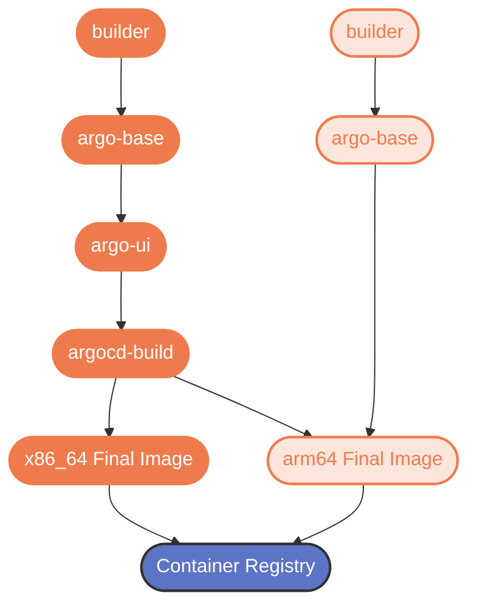

# Argo CD image build speedup test
Disclaimer: Do not use any of these files in production!!! All files in this repository have been copied over from github.com/argoproj/argo-cd for testing purposes except for the .github.workflows directory. This repository will most likely be removed within 30 days.

## The purpose for this repository is testing a solution to speedup the build proccess of images for Argo CD.
Images being built on arm64 are taking an excessive amount of time due to the emulation of the architecture they are being built on.  In particular the argocd-ui stage which performs `yarn install --network-timeout 200000` & `RUN HOST_ARCH='amd64' NODE_ENV='production' NODE_ONLINE_ENV='online' NODE_OPTIONS=--max_old_space_size=8192 yarn build`

### tl;dr

Adding cache was helpful in speeding up image build times by 2x. These changes improve build times by a total of **8x** while maintaining backwards compatability. The flowchart below shows how the Dockerfile is processed using cross-compilation. Orange nodes are `x86_64` and opaque orange nodes are `arm64`  Using hardware emulation is to slow for the `argocd-ui` and `argocd-build` stages.

### Dockerfile improvements

We can leverage the build host architecture ($BUILDPLATFORM) to build the `argocd-ui` stage since it only produces artifacts which are platform independent, saving approx. 38 mins in build time.

The `argocd-build` stage can also be built on the build host architecture (\$BUILDPLATFORM) to cross compile the Argo binaries by passing in `ARG TARGETOS TARGETARCH`. These are the parameters used in `buildx --platform linux/amd64,linux/arm64` . Setting `RUN GOOS=$TARGETOS GOARCH=$TARGETARCH make argocd-all` will instruct buildx to compile architectures listed with `--platforms` .  The binaries are then passed into the Final Image for each architecture.  With these changes build times have been 10-12 mins on github runners. Ref: https://docs.docker.com/engine/reference/builder/#automatic-platform-args-in-the-global-scope



### Test Performed

- Built Images with github runners
- Built Images locally
- Pushed to a registry
- Verified binaries built properly inside container (podman & docker run ...)
- Ran on native arm64 cluster (Raspberry Pi Cluster)
- Ran on x86_64 cluster (Kind and Minikube)

```yaml
apiVersion: kustomize.config.k8s.io/v1beta1
kind: Kustomization

images:
- name: quay.io/argoproj/argocd
  newName: ghcr.io/34fathombelow/argocd_image_speedup
  newTag: latest

namespace: argo-cd-test
resources:
- https://raw.githubusercontent.com/argoproj/argo-cd/master/manifests/install.yaml
```
